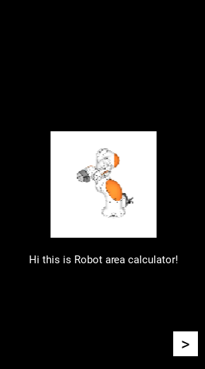
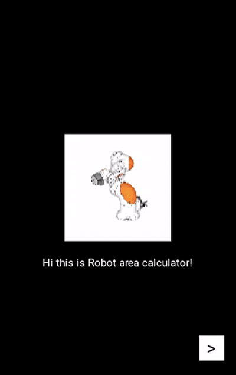

# 🤖 Robot Area Calculator

Application for calculating and visualizing the workspace of industrial robots
\
---

<p align="center">
  
</p>

## 📖 Overview

During my studies, I often had to determine the dimensions of robot cells based on robot reach. To simplify these calculations and provide a clear graphical representation, I developed this application.

The application was designed to save time and visually display the robot workspace together with the dimensions required for building a robot cell with an additional safety margin according to the following criteria:

* 🟢 Minimum zone;
* 🟡 Working zone;
* 🔴 Maximum zone.

In addition, the program automatically determines the robot cell dimensions and provides a graphical representation of the calculated workspace.

The project is currently under development and new features are planned for future releases.

---

## 🖼️ Screenshots 

### 🚀 Start screen (https://github.com/Andrey7522/Robot-area-calculator/blob/master/screenshots/1.png)

### 📝 Input parameters (https://github.com/Andrey7522/Robot-area-calculator/blob/master/screenshots/2.png)

### 📊 Workspace visualization (https://github.com/Andrey7522/Robot-area-calculator/blob/master/screenshots/4.png)

---

## ✨ Features

* ✔ Multi-screen interface
* ✔ Input field validation
* ✔ Automatic workspace calculation
* ✔ Dynamic cell dimensions
* ✔ Graphical representation of robot zones
* ✔ Simple and intuitive interface

---

## 🔧 Example


<p align="center">
  
  <br>
  <em>Animation of the folding mechanism</em>
</p>

Using a KUKA robot:

1. Launch the application.
2. Enter left and right reach dimensions.
3. Specify the tool length.
4. Move to the result screen.
5. View the calculated robot workspace and cell dimensions.

### 🎨 Color legend

| Zone         | Color     |
| ------------ | --------- |
| Minimum zone | 🟢 Green  |
| Working zone | 🟡 Yellow |
| Maximum zone | 🔴 Red    |

---

## 📐 Mathematical Model

The total radius is calculated from the robot reach and tool length:

[
R = L_{left} + L_{right} + L_{tool}
]

where:

* (L_{left}) — left reach;
* (L_{right}) — right reach;
* (L_{tool}) — tool length.

### 🟢 Minimum zone

[
R_{min}=0.25R
]

### 🟡 Working zone

[
R_{work}=0.6R
]

### 🔴 Maximum zone

[
R_{max}=0.9R
]

### 📏 Robot cell dimensions

[
Cell = R + 500\ mm
]

where **500 mm** represents an additional safety margin.


## ⚙️ Installation

Clone repository:

```bash
git clone https://github.com/username/Robot-area-calculator.git
```

Install dependencies:

```bash
pip install -r requirements.txt
```

Run the application:

```bash
python main.py
```

---

## 🛠️ Technologies

* Python
* Kivy
* KivyMD
* PyInstaller

---

## 🚀 Future Improvements

* [ ] Improved UI design
* [ ] Additional graphical elements
* [ ] Support for different robot configurations
* [ ] Export results to image
* [ ] Save projects
* [ ] Screenshot manager

---

## 📌 Current Status

⚠ Prototype version.

The main functionality has been successfully implemented and tested. The Windows executable version is fully operational and provides the intended calculations and graphical visualization.

Further improvements are mainly focused on the Android version, where the application architecture and user interface require additional refinement. New features and visual enhancements are planned for future releases.

---

## 👨‍💻 Author: Andrey Chebotarev


